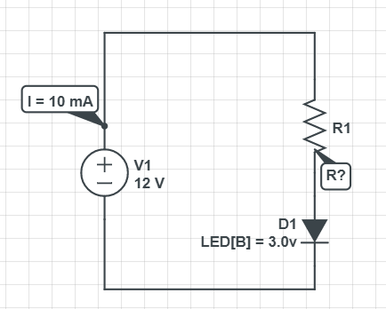
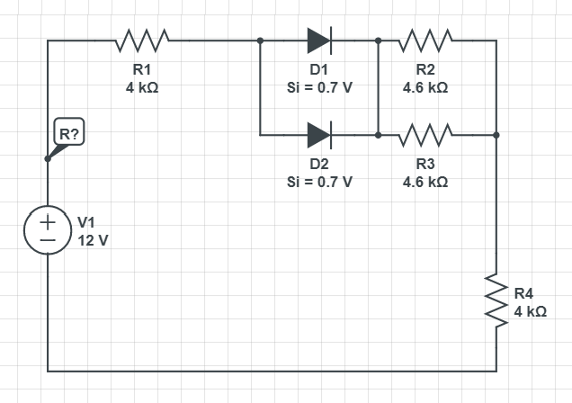
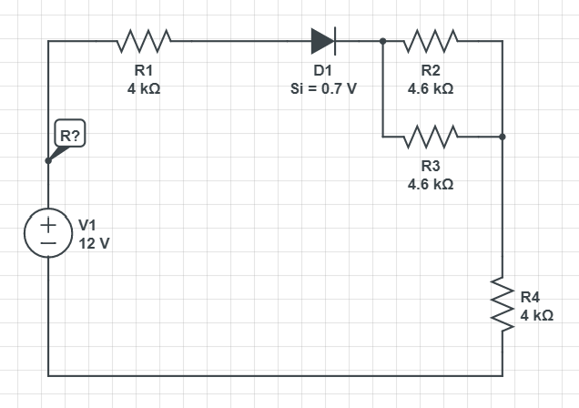

`13.03.18` `cz3`

# Dioda

### Przykład 1

Prąd nie popłynie bo dioda jest w kierunku zaporowym!

### Przykład 2

Prąd popłynie przy czym duży!  
Rezystancja diody jest bardzo mała (wynika z wykresu/wartości progowej) przez co napięcie będzie bardzo duże i najprawdopodobnie dioda po prostu zepsuje się.  

### Przykład 3

Policzyć I obwodu:

U[R1] = U - U[D1] = 4.5 V - 1.5 V = 3 V   

(Prawo Oma)  
I = U[D1] / R = 3 V / 3000 Ω = 0.001 A = **1 mA**

### Przykład 4

I = 10 mA  
Policzyć R obwodu:

U[R1] = U - U[D1] = 12 V - 3 V = 9 V  

(Prawo Oma)  
I = U[R1] / R
    ⇒
        R = U[R1] / I = 9 V / 10 mA = **900 Ω**  

### Przykład 5

Policzyć opór w obwodzie:  

**W połączeniu szeregowym kolejność nie ma znaczenia!**  

Diody w takim układzie mogą być połączone i to efektywnie nie zmieni niczego.  

**Diody rozmieszczone równolegle mogą być zastąpione przez jedną o mniejszym napięciu progowym!**

  

Dalsze kroki są banalne.
Odpowiedź: 13k Ω

### Przykład 6

Policzyć opór w obwodzie:  
  

Zauważamy, że D3 jest w zaporowa. Możemy ją wytrzeć.  
Dalsze postępowanie jest analogiczne do przykładu 5.  
Odpowiedź: 13k3 Ω

`20.03.18` `cz4`

# Przykład 1

Do przykładu który był na wykładzie dodamy rezystor  

| U | VB | RE | IE | IC | RC | VRC | K | VRE |  
| ---   | --- | --- | ---   | ---       | ---   | ---   | ---   | ---   |  
| 5     | 0.8 | 200 | 1 m   | ~1 m      | 2 k   | 3     | ?     | 0.2   |  
| 5     | 0.9 | 200 | 1.5 m | ~1.5 m    | 2 k   | 2     | -10   | 0.3   |  
| 5     | 0.9 | 200 | 1.5 m | ~1.5 m    | 1 k   | 1.5   | -5    | 0.3   |  
| 5     | 0.8 | 100 | 2 m   | ~2 m      | 1 k   | 2     | -10   | 0.2   |  
| 5     | 0.9 | 100 | 3 m   | ~3 m      | 1 k   | 3     | -5    | 0.3   |  

`27.03.18` `cz5`

# Bramki logiczne

## NOT
[symulacja](http://tinyurl.com/ycptp8wk)

## AND  
[symulacja](http://tinyurl.com/ybwdvv3u)  

## OR  
[symulacja](http://tinyurl.com/y8pnodag)  

## NOR
[symulacja](http://tinyurl.com/y79hqskc)  

## XOR
[symulacja (oryginal)](http://tinyurl.com/yc5y8jjn)  
[symulacja 2](http://tinyurl.com/y869wbe7)  

