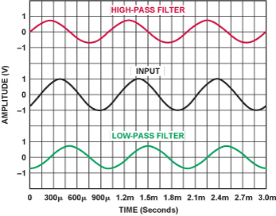
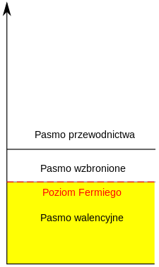

` 26.02.18` `wy1`
# organizacja

Obecnosc na wykladzie - obowiązkowo

[liza](http://liza.umcs.lublin.pl/~skotyra)

# Prąd
to jest uporządkowany ruch elektronów lub jonów  

### Jon
są jony dodatnie i ujemne.
oba rodzaje jonów powstają przy dysocjacji.
jony dodatnie i ujemne powstają z kwasów/zasad/soli pod wpływem wody.
jony dodatnie to kationy, a jony ujemne to aniony.

### Dysocjacja 
to kiedy cząsteczka rozpada sie na dwie rożne

Na przykładzie wody:  
NaCl : Chloryksod  
C[1][3]H[2][2]O[1][1] : Sacharoza  
Gdy powyższe dodamy w wodę odbywa sie dysocjacja  
H2O Jest nie-symetryczna, to powoduje, że jest ona bardziej pozytywna z jednej strony (H+)  
  
Przez co, Cl[-] przyciągany jest do H+, a Na[+] jest przyciągany do O-, i tak się rozdzielia  
W przypadku C[1][3]H[2][2]O[1][1] -> C[1][3]H[2][2]O[1][1] (nie zmienia się)  
W przypadku NaCl -> Na[+]Cl[-]   
gdzie + to kationy, - to aniony

# Obwody prądu
` będziemy zajmowały się tylko obwodami prądu stałego `

Elementy obwodu = Aktywne || Bierne 

### Źródło napięcia 
[symbole elektroniki](https://en.wikipedia.org/wiki/Electronic_symbol)  
Może to być ogniwo lub bateria  
  
W baterii + jest przy krótkiej kresce  
Łączenie szeregowe ogniw, daje sumę arytmetyczną napięć

### Prawa kirchhoff
1. Kiedy prąd **I** się rozdziela na **I1, I2** to suma ich napięć **I1 + I2** jest równa początkowemu **I1 + I2 = I**  
2. Suma spadków napięć (np. od resistora), musi być równa napięciu zasilającemu

### Prawo Ohma I = V / R
(U <=> V)  
Opór R jest mierzony w Omach  

Czyli, gdy mamy opornik(resistor) **R**, pochloni on tyle napięcia wyjściowego **V**, że na wyjściu będziemy mieć napięcie **I** takie, że **I = V / R**   
  

`05.03.18` `wy2`

Jak widać z wykresu, dla zwykłych oporników, prawo oma jest to po prostu funckja liniowa o współczynniku 1/R.  
Ale prawo oma nie jest liniowe dla baterii i diody  

## Kondensator

 Symbol

Jest elementem biernym  
C = pojemność kondensatora mierzona w Faradach. Jest to inaczej zdolność do utrzymania ładunku  

Prawo oma też nie jest liniowe dla kondensatora. Jego zasilanie wygląda tak:  
  
Energia zgromadzona przez kondensator to energia pola elektrycznego które utrzymuje ładunki na okładkach kondensatora  

Typy zasilania kondensatora = całkujący || różniczkujący

Niech:

    U = napięcie do którego możemy naladować kondensator
    I = prąd zasilający
    I : Stały
    C = pojemność kondensatora
    t = czas
Wtedy:

    U = (I * t) / C

Niech zatem:

    U[c] = napięcie kondensatora
    U[z] = napięcie zasilające
Wtedy:

    U[c] = U[z] * (1 - e ^ (-t / (R * C)))

    R * C : sekundy
    R * C = stała czasowa

Przy 5 * R * C przyjmujemy, że kondensator jest całkowicie naładowany, chociaż jak to wynika z równania, w rzeczywistości nigdy nie jest całkowicie naładowany.

### Fala prostokątna
Tak wygląda fala prostokątna:  
 

A tak wygląda zasilanie kondensatora na fonie fali prostokątnej:  
  
  

### Filtr dolnoprzepustowy
[_low-pass-filter_](https://en.wikipedia.org/wiki/Low-pass_filter)  
Polega na tym, że zmienność napięcia na źródle napięcią jest _zgładzana_ przez kondensator  
  
Widać też, że dolny wykres jest _z opóźnieniem_, oznacza to że ma zmieszczoną fazę

## Cewka (Element indukcyjny)  
 Symbol

Przechowuje energie w postaci pola magnetycznego  
Jest w jakimś stopniu przeciwieństwem kondynsatora  
Dużo rzeczy komplikuje, dlatego jej często się unika, jak też np. w kursie architektur na UMCS  

# Elementy półprzewodnikowe
## Def: półprzewodniki

    Są to substacje których konduktywność może być zmieniana w szerokim zakresie.
    Czyli mogą pełnić role przewodników bądź izolatorów.
    Ich konduktywność zależy m. in. od temperatury, oświetlenia, innych elementów (domieszków)  
---
    Półprzewodniki = Samoistne || Domieszkowane

{ Si _(krzem)_, Al _(glin)_, Ge } <: Półprzewodniki samoistne

`12.03.18` `wy3`

## Struktura półprzewodników samoistnych

Przyjmuje się, że w temperaturze zera bezwzględnego w _paśmie przewodnictwa_ nie ma elektronów, natomiast w wyższej temperaturze powstają pary elektron–dziura; im większa wartość temperatury, tym więcej takich par jest generowanych.  

Na przykładzie Si:  
Jak mamy temperaturę = Abs 0, każdy atom Si ma 4 elektrony na powłoce wałencyjnej. Atomy Si tworzą sieć gdzie każdy z 4 elektronów ma powiązanie z elektronem sąsiadującego atomu Si.  
  
Natomiast gdy temperatura zwiększa się, niektóre z tych elektronów zrywają połączenia, tworząc na tym miejscu **dziurę**  

### Def :: powłoka wałencyjna
Jest to ostatnia, najdalej odsunięta od jądra powłoka elektronowa atomu. Elektrony na niej są najsłabiej związane z atomem przez co mogą przemieszczać się między sąsiadujące atomy i uczestniczyć w tworzeniu wiązań chemicznych. W przypadku elektronów znajdujących się niżej zazwyczaj nie jest to możliwe, choć są od tego liczne wyjątki.
### Def :: pasmo przewodnictwa
Jest to z analogii obszar w którym elektrony są najsłabiej powiązane z atomem i swobodnie przemieszczają się między nimi.  

  

## Domieszkowanie
Oznacza to, że dodamy do połprzewodników samoistnych innych elementów **z tego samego [okresu](https://pl.wikipedia.org/wiki/Uk%C5%82ad_okresowy_pierwiastk%C3%B3w#Wygl%C4%85d_wsp%C3%B3%C5%82czesnego_uk%C5%82adu_okresowego)** układu pierwiastków.  

Efekt będzie zależać od tego czy dodane pierwiastki mają więcej elektronów na powłoce wałencyjnej, czy mniej.  
- **Więcej**  
    Jeśli do Si, który ma 4 elektrony, dodamy P, który ma 5, okaże się, że podczas tworzenia sieci, dla tego 1 nadmiarowego elektronu już nie będzie miejsca na powłoce wałencyjnej i przejdzie on na poziom wyżej (poziom _donorowy_), a to też oznacza, że nie będzie tak on mocno przywiązany do jednego miejsca w wyniku czego takie połączenie Si+P zmniejsza opór przewodnika.  
    Takiego typu połączenie nazywamy **typu N** (bo są nadmiarowe elektrony -> Negative potential)   
- **Mniej**  
    Jeśli do tego samego Si dodamy Al, który ma 3 elektrony na powłoce wałencyjnej, wtedy w połączeniach między Si a Al będzie brakowało jednego elektronu, co nazywamy _dziurą_. W wyniku utworzenia wolnych miejsc, tutaj podobnie powstaje nowy poziom - _akceptorowy_ co sprzyja szybszemu przemieszczeniu elektronów(dziur) (czyli mniejszej oporności). Tego typu półprzewodniki nazywamy "tupy P" (od Positive bo brakuje elektronów)  

## Zalety domieszkowania
Jak już było wspomniano, domieszkowanie zmniejsza opór samoistnych półprzewodników, natomiast najwyższa użyteczność powstaje przy połączeniu dwóch materiałów o typie P i typie N.  

## Dioda
 (K: katoda-, A: Anoda+)

Najbardziej ciekawą częścią diody, jest obszar styku materiałów o typie P i N. Odbywa się na tym obrzaże tzw. _rekombinacja_ elektronów i dziur, co znaczy, że elektrony materiału o typie N, uzyskują dostęp do niższych poziomów w miejscach połączenia pierwiastków materiału typu P, gdzie domyślnie są dziury. Naturalnie powstaje ruch elektronów (=prąd) i uwolnienie energii w postaci światła (najczęściej).  

## Dioda + bateria
Dioda przepuszcza prąd tylko w jednym kierunku.
