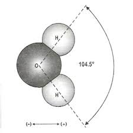
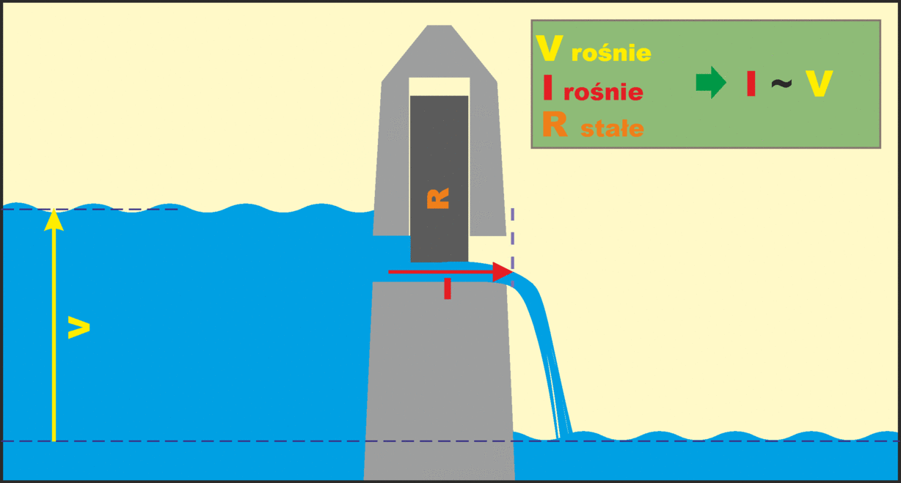
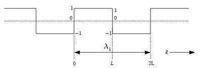

` 26.02.18`
# organizacja

Obecnosc na wykladzie - obowiązkowo

[liza](http://liza.umcs.lublin.pl/~skotyra)

# Prąd
to jest uporządkowany ruch elektronów lub jonów  

### Jon
są jony dodatnie i ujemne.
oba rodzaje jonów powstają przy dysocjacji.
jony dodatnie i ujemne powstają z kwasów/zasad/soli pod wpływem wody.
jony dodatnie to kationy, a jony ujemne to aniony.

### Dysocjacja 
to kiedy cząsteczka rozpada sie na dwie rożne

Na przykładzie wody:  
NaCl ∈ Chloryksod  
C₁₃H₂₂O₁₁ ∈ Sacharoza  
Gdy powyższe dodamy w wodę odbywa sie dysocjacja  
H2O Jest nie-symetryczna, to powoduje, że jest ona bardziej pozytywna z jednej strony (H+)  
  
Przez co, Cl₋ przyciągany jest do H+, a Na₊ jest przyciągany do O-, i tak się rozdzielia  
W przypadku C₁₃H₂₂O₁₁ → C₁₃H₂₂O₁₁ (nie zmienia się)  
W przypadku NaCl → Na₊Cl₋   
gdzie + to kationy, - to aniony

# Obwody prądu
` będziemy zajmowały się tylko obwodami prądu stałego `

Elementy obwodu = Aktywne ∪ Bierne 

### Źródło napięcia 
[symbole elektroniki](https://en.wikipedia.org/wiki/Electronic_symbol)  
Może to być ogniwo lub bateria  
  
W baterii + jest przy krótkiej kresce  
Łączenie szeregowe ogniw, daje sumę arytmetyczną napięć

### Prawa kirchhoff
1. Kiedy prąd **I** się rozdziela na **I1, I2** to suma ich napięć **I1 + I2** jest równa początkowemu **I1 + I2 = I**  
2. Suma spadków napięć (np. od resistora), musi być równa napięciu zasilającemu

### Prawo Ohma I = V / R
(U ⇔ V)  
Opór R jest mierzony w Omach  

Czyli, gdy mamy opornik(resistor) **R**, pochloni on tyle napięcia wyjściowego **V**, że na wyjściu będziemy mieć napięcie **I** takie, że **I = V / R**   
  

`05.03.18`

Jak widać z wykresu, dla zwykłych oporników, jest to prosta funckja liniowa o współczynniku 1/R  

## Kondensator

 Fala prostokątna

Zasiłanie nie jest liniowe także dla kondensatora. Jego zasilanie i rozładowanie wygląda tak:  
  
Energia zgromadzona przez kondensator to energia pola elektrycznego  

Są dwa typy zasiłania: całkujący i różniczkujący

Niech:

    U = napięcie do którego możemy naladować kondensator
    I = prąd zasilający
    I ∈ Stały
    C = pojemność kondensatora
    t = czas
Wtedy:

    U = (I × t) / (C)

Niech zatem:

    U[c] = napięcie kondensatora
    U[z] = napięcie zasilające
Wtedy:

    U[c] = U[z] × (1 - e ↑ (-t / (R × C)))

NOTE:

    R × C = stała czasowa
    R × C ∈ sekundy

Przy 5 × R × C przyjmujemy, że kondensator jest całkowicie naładowany, chociaż jak to wynika z równania, w rzeczywistości nigdy nie jest całkowicie naładowany.

### Filtr dolnoprzepustowy
[_low-pass-filter_](https://en.wikipedia.org/wiki/Low-pass_filter)  
Polega na tym, że zmienność napięcia na źródle napięcią jest _zgładzana_ przez kondensator  
  
Widać też, że dolny wykres jest _z opóźnieniem_, oznacza to że ma zmieszczoną fazę

## Cewka (Element indukcyjny)  
Przechowuje energie w postaci pola magnetycznego  

# Elementy półprzewodnikowe
## Def: półprzewodniki

        "Są to substacje których konduktywność może być zmieniana w szerokim zakresie.
         Czyli mogą pełnić role jak przewodników tak i izolatorów.
         Konduktywność zależy m. in. od temperatury, oświetlenia, innych elementów (domieszków)"  
  
    Półprzewodniki = Samoistne ∪ Domieszkowane

Si ∈ Samoistne  

